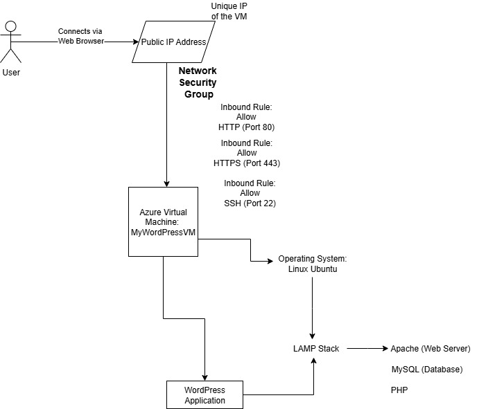
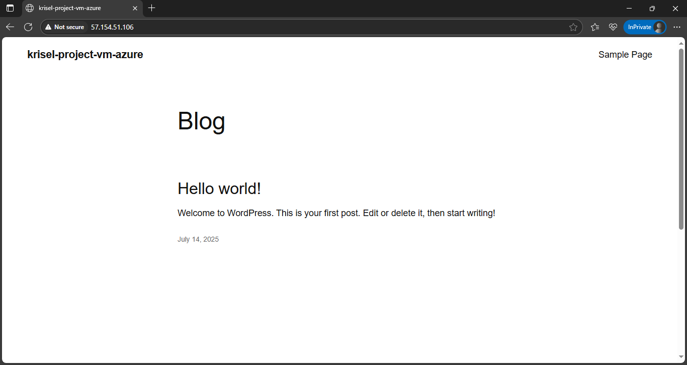

# Deploying a WordPress Site on an Azure Linux VM

## Project Description


This project demonstrates the process of provisioning a cloud infrastructure from scratch on Microsoft Azure. I deployed a complete, functional WordPress blog by setting up a Linux virtual machine, configuring its network security, and installing a full LAMP stack (Linux, Apache, MySQL, PHP).

## Technology Used

- **Cloud Provider** : Microsoft Azure
- **Core Infastructure** : Azure Virtual Machines, Virtual Networks (VNet), Network Security Groups (NSGs), Public IP Addresses
- **Operating System** : Linux (Ubuntu 22.04 LTS)
- **Web Stack** : Apache2 (Web Server), MySQL (Database), PHP
- **Application** : WordPress (Content Management System)
- **Security** : Firewall rule configuration (SSH, HTTP, HTTPS), user/password administration

## Architecture Diagram
Here is the architecture of the final deployed application. It outlines the flow of traffic from the end-user through the Azure network components to the virtual machine hosting the WordPress site.



## Installation Steps

- **Provisioned the Virtual Machine** : Created an Ubuntu 22.04 VM in the Azure Portal, configured with a B1s size and attached a public IP.
- **Configured Networking** : Set up a Network Security Group with inbound rules to allow traffic on port 22 (SSH), 80 (HTTP), and 443 (HTTPS).
- **Installed LAMP Stack** : Connected to the VM via SSH and ran the following commands to install the web server, database, and PHP
   ```bash
    sudo apt update
    sudo apt install apache2
    sudo apt install mysql-server
   ```
- **Secure MySQL and Create Database**
   ```bash
    sudo mysql_secure_installation
    sudo mysql
   ```
   ```sql
   CREATE DATABASE wordpress DEFAULT CHARACTER SET utf8 COLLATE utf8_unicode_ci;
   CREATE USER 'wordpressuser'@'localhost' IDENTIFIED BY 'password';
   GRANT ALL ON wordpress.* TO 'wordpressuser'@'localhost';
   FLUSH PRIVILEGES;
   EXIT;
   ```
- **Download and Configure WordPress**
  ```bash
  cd /tmp
  curl -O https://wordpress.org/latest.tar.gz
  tar xzvf latest.tar.gz
  sudo cp -a /tmp/wordpress/. /var/www/html/
  ```
- **Set Permissions and Clean Up**
  ```bash
  sudo chown -R www-data:www-data /var/www/html/
  sudo rm /var/www/html/index.html
  ```
- **Edit WordPress Configuration**
  ```bash
  sudo nano /var/www/html/wp-config.php
  ```
  *We have to edit the php file with the database credentials*
- **Restart Web Server**
  ```bash
  sudo systemctl restart apache2
  ```

## Final Result

